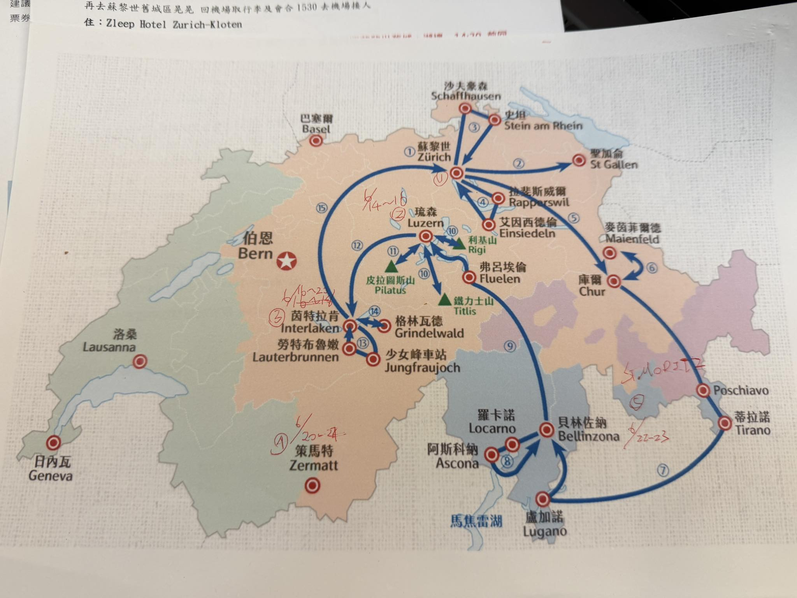

# Main Itinerary / 主行程

## 行程總覽

以下是**已整理好的乾淨版行程表**

### 行程地圖

| Day | 日期 | 住宿地點 | 移動方式 / 路段 | 上午行程 | 下午行程 | 晚間 / 備註 |
| ----- | ----- | ----- | ----- | ----- | ----- | ----- |
| D1 | 6/13(六) | 蘇黎世 Zurich | 機場 → 飯店 → 機場（22:00取車） | 抵達、入住/寄放行李 | 蘇黎世老城：林登霍夫山、班霍夫大街 | Avis 櫃檯取車、調整時差 |
| D2 | 6/14(日) | 琉森 Luzern | 蘇黎世 → 琉森（約50分） | 開車前往琉森、飯店Check-in | 市區散步：卡貝爾橋、垂死獅子像、穆塞格城牆 | 琉森湖畔兜風 |
| D3 | 6/15(一) | 琉森 Luzern | 琉森 ↔ Vitznau | 開車至Vitznau、搭登山火車 | 瑞吉山Rigi健行（Rigi Kulm → Kaltbad） | 超市補給、準備進山 |
| D4 | 6/16(二) | 格林德瓦 Grindelwald | 琉森 → 格林德瓦 | Lungern綠湖、Brünig山口 | Iseltwald午餐、布里恩茨湖 | 艾格峰北壁夕陽 |
| D5 | 6/17(三) | 格林德瓦 Grindelwald | 車停飯店/車站 | 少女峰：Eiger Express、冰河體驗 | 斯芬克斯觀景台、Eiger Walk | 起司鍋晚餐 |
| D6 | 6/18(四) | 格林德瓦 Grindelwald | 車停飯店 | First Cliff Walk | Bachalpsee健行、冒險活動下山 | 村莊逛街、採買 |
| D7 | 6/19(五) | 格林德瓦 Grindelwald | 格林德瓦 ↔ Lauterbrunnen（約20分） | 瀑布鎮、施陶河瀑布 | 米倫Mürren、Allmendhubel | 整理行李 |
| D8 | 6/20(六) | 策馬特 Zermatt | 格林德瓦 → 策馬特 | 藍湖Blausee | Kandersteg汽車火車、Täsch轉火車 | 策馬特夜景、拍馬特洪峰 |
| D9 | 6/21(日) | 聖莫里茲 St. Moritz | 策馬特 → 聖莫里茲 | 葛納葛特、馬特洪峰 | 冰河列車路線自駕、Furka Pass | 晚間抵達聖莫里茲 |
| D10 | 6/22(一) | 聖莫里茲 St. Moritz | 市區停車｜搭火車 | 伯連納列車、白湖、螺旋橋 | Tirano午餐、教堂 | 莫爾特拉奇冰川（視體力） |
| D11 | 6/23(二) | 蘇黎世 Zurich | 聖莫里茲 → 蘇黎世 | 海蒂村Maienfeld | 列支敦士登Vaduz | 晚餐、22:00 前還車 |
| D12 | 6/24(三) | 溫暖的家 | 飯店 → 機場（已還車） | 悠閒早餐 | 整理行李、退稅 | 離境返家 |

---

## 訂單摘要（已去除個資）

以下內容由訂單 PDF 整理而來，僅保留行程操作需要的資訊；確認號、PIN、旅客姓名、個人聯絡方式與付款識別資訊不放在公開頁面。

### 租車訂單摘要

| 項目 | 內容 |
| ----- | ----- |
| 租車公司 | Avis |
| 取車 | 2026/6/13 22:00，Zurich Airport，Flughafen Parking 3 |
| 還車 | 2026/6/23 22:00，Zurich Airport，Flughafen Parking 3 |
| 車款 | Luxury Van - Mercedes-Benz Vito or Similar |
| 預估總額 | CHF 1,489.10 |
| 費用明細 | Base Rate CHF 1,147.93；Taxes and Surcharges CHF 341.17 |
| 里程 | 4,399 km included；超出 CHF 0.80/km |
| 油箱政策 | Full to Full |
| 已含項目 | Additional Driver、Theft Protection (TP)、Collision Damage Waiver (CDW) 顯示為 CHF 0.00 |
| 取車提醒 | 攜帶駕照正本、國際駕照、護照與信用卡；現場確認跨境規則、自負額、額外駕駛與高速公路通行證 |

### 住宿訂單摘要

| 日期 | 地點 | 住宿 | 房型 / 人數 | 入住 / 退房 | 費用摘要 | 取消與現場資訊 |
| ----- | ----- | ----- | ----- | ----- | ----- | ----- |
| 6/13-6/14 | Zurich-Kloten | Zleep Hotel Zürich-Kloten，Bahnhofstrasse 7, 8302 Kloten | 3 間標準雙人房；共 6 adults；無餐食 | 入住 14:00-23:00；退房 01:00-12:00 | 約 TWD 19,739 / CHF 483，含 3.80% VAT 與城市稅 | 入住日前 1 天前可免費取消；公共停車 CHF 25/day；Wi-Fi 免費 |
| 6/14-6/16 | Goldau | Anstatthotel Goldau - self-check-in，Gotthardstrasse 59, 6410 Goldau | 1 間 Superior Studio；共 6 adults；無餐食 | 入住 16:00-23:30；退房 00:00-10:00 | Final price 約 TWD 25,747；現場/訂單幣別 CHF 630.00，含城市稅 | 2026/6/11 23:59 前可免費取消；停車 CHF 7/day；Wi-Fi 免費 |
| 6/16-6/20 | Interlaken | KARL Apartment，Friedweg 8, 3800 Interlaken | 1 間雙臥室公寓；共 6 adults；無餐食 | 入住 15:00-23:00；退房 07:00-10:00 | Final price 約 TWD 92,115；現場/訂單幣別 CHF 2,254.00，含清潔費 CHF 90 與城市稅 | 2026/6/10 23:59 前可免費取消；免費私人停車；Wi-Fi 免費 |
| 6/20-6/21 | Täsch | Hotel Matterhorn Inn，Kantonsstrasse 171, 3929 Täsch | 3 間雙人房；共 6 adults；無餐食 | 入住 15:00-23:30；退房 07:00-11:00 | Final price 約 TWD 22,722；現場/訂單幣別 CHF 556.00，含城市稅 | 入住日前 7 天前可免費取消；私人停車 CHF 10/day；Wi-Fi 免費；Zermatt 僅可由 Täsch 搭接駁火車抵達 |
| 6/21-6/23 | Celerina | Chesa Pradatsch Suot 5 - Celerina，Vietta Saluver 8, 7505 Celerina | 1 間公寓；共 6 adults；無餐食 | 入住 16:00-20:00；退房至 11:00 | 約 TWD 24,749 / CHF 605.60，含清潔費 CHF 200 | 2026/6/6 23:59 前可免費取消；免費公共停車；Wi-Fi 免費 |

### 訂單操作提醒

* 原始 PDF 與確認資訊只放在私人保存位置，不直接公開連結。
* 每次入住前一天確認入住時間、停車規則與是否需要自助入住資訊。
* 需要取消或修改時，以各住宿當地時間的免費取消期限為準。

---

### **Day 1: 6/13 (六) 蘇黎世抵達與適應**

*目標：順利取車、適應時差、市區漫遊、三團會合*

#### Team 1 (台灣組 - 國泰航空經香港)
* **07:10** 抵達蘇黎世機場 (ZRH)，辦理入境與拿行李。
* **上午-下午** 前往飯店辦理入住或寄放行李，再安排蘇黎世市區散步。
* **16:30 \- 18:00** **【市區散步】** 步行至 **林登霍夫山 (Lindenhof)** 眺望老城區，接著逛 **班霍夫大街 (Bahnhofstrasse)**。  
* **18:00 \- 19:30** 晚餐：蘇黎世老城區（推薦 Zeughauskeller 軍火庫餐廳的烤香腸與啤酒）。  
* **20:00** 返回機場，準備迎接 Team 2 & Team 3

#### Team 2 (新加坡組 - 阿聯酋航空經杜拜)
* **20:05** 抵達蘇黎世機場（與 Team 3 同班機 EK085）
* **20:05 \- 22:00** 與 Team 1, Team 3 會合，在機場等待取車時間
  * 可在機場用晚餐或簡單休息
  * [Team 2 航班摘要](docs/team2-flight-schedule.md)
  * [Team 2 杜拜轉機行程建議](docs/team2-dubai-transit-itinerary.md)

#### Team 3 (吉隆坡組 - 阿聯酋航空經杜拜)
* **20:05** 抵達蘇黎世機場（與 Team 2 同班機 EK085）
* **20:05 \- 22:00** 與 Team 1, Team 2 會合，在機場等待取車時間
  * Team 2 & Team 3 可在杜拜轉機時段會合（Team 2: 04:50 抵達，Team 3: 05:05 抵達）
  * [Team 3 航班摘要](docs/team3-flight-schedule.md)
  * [杜拜轉機行程建議](docs/team2-dubai-transit-itinerary.md)（Team 2 & 3 共用）

#### 三團會合
* **22:00** **【Avis 取車】** Team 1 + Team 2 + Team 3 一起前往 Zurich Airport 租車櫃檯取車
  * 車款：Luxury Van - Mercedes-Benz Vito or Similar
  * 使用私下保存的 Avis 訂單或確認信核對取車資料
  * 確認車況、油箱 full-to-full、輪胎、外觀與高速公路通行證 Vignette
* **22:30** 一起開車前往 Zleep Hotel Zurich-Kloten（車程約3分鐘）
* **23:00** Check-in 休息

---

### **Day 2: 6/14 (日) 蘇黎世 → 琉森 (古城與湖畔)**

*移動：蘇黎世 → 琉森 (車程約 50 分鐘)*

* **09:00 \- 10:00** 飯店早餐，退房。  
* **10:00 \- 11:00** **【自駕移動】** 開車前往琉森 (Luzern)。  
* **11:00 \- 12:30** 抵達琉森飯店，寄放行李/停車。  
* **12:30 \- 14:00** 午餐：老城區河畔餐廳。  
* **14:00 \- 15:30** **【地標巡禮】** 參觀 **卡貝爾橋 (Chapel Bridge)**、水塔。  
* **15:30 \- 16:30** 步行至 **垂死獅子像 (Lion Monument)**。  
* **16:30 \- 18:00** **【城牆漫步】** 登上 **穆塞格城牆 (Musegg Wall)**，俯瞰琉森湖景。  
* **18:00 \- 19:30** 開車沿著琉森湖畔兜風 (往 Meggen 方向)，欣賞湖光山色。  
* **19:30 \-** 晚餐與自由活動。

---

### **Day 3: 6/15 (一) 瑞吉山 (Rigi) 山中皇后**

*重點：自駕至登山口、體驗登山火車*

* **08:30 \- 09:15** 飯店出發，開車前往 **Vitznau** (約 30-40 分鐘)。  
* **09:15 \- 09:45** 將車停在 Vitznau 車站旁停車場。  
* **10:15 \- 10:50** **【登山火車】** 搭乘紅色火車 Vitznau → Rigi Kulm (山頂)。  
* **11:00 \- 12:30** **【山頂健行】** Rigi Kulm 360度觀景台，步行至 Rigi Staffel。  
* **12:30 \- 13:30** 山上簡餐 (自備野餐或景觀餐廳)。  
* **13:30 \- 15:00** 健行段：Rigi Staffel 走到 **Rigi Kaltbad** (平緩好走，視野開闊)。  
* **15:00 \- 15:30** **【下山】** 從 Rigi Kaltbad 搭火車回 Vitznau 取車。  
* **16:00 \- 17:00** 取車，開車回琉森。  
* **17:00 \- 19:00** 琉森市區逛街 (Coop 超市補給，準備明日進山區)。  
* **19:00 \-** 晚餐。

從 **Rigi Kulm** 前往 **Rigi Kaltbad** 有幾種簡單又風景好的選擇。

---

## 

##  **最推薦：健行下山（約 30–40 分鐘）**

* **距離**：約 2 公里  
* **時間**：30–40 分鐘  
* **難度**：簡單～中等（下坡為主）  
* **路線**：  
  從 Rigi Kulm 依照指標走 **「Rigi Kaltbad / Känzeli」** 方向  
* **特色**：  
  * 阿爾卑斯山景＋湖景（琉森湖）  
  * 非常適合拍照、慢慢走  
  * 路線清楚，不易迷路

如果天氣好、體力OK，這是**最棒的體驗方式**

**從 Rigi Kaltbad 回到 Vitznau（取車、轉火車/船等），你可以這樣搭交通工具 👇**

### **🚆 1\. 齒軌火車（最常用）**

* **搭乘路線：從 Rigi Kaltbad-First（車站） 搭 齒軌火車（Rigi Bahn） 往 Vitznau**

* **在哪裡搭？**  
   **在 Rigi Kaltbad-First 火車站月台 上車（Rigi Kaltbad 纜車站旁走一小段即可到達）[Rome2Rio](https://www.rome2rio.com/s/Rigi-Kaltbad-Station/Vitznau?utm_source=chatgpt.com)**

* **行程時間：約 25 分鐘 到 Vitznau 車站（終點站）[Rome2Rio](https://www.rome2rio.com/s/Rigi-Kaltbad-Station/Vitznau?utm_source=chatgpt.com)**

* **票務方式：可在站內售票機或 Rigi Bahn 官網購票／使用 Swiss Travel Pass（如果有的話）[Rome2Rio](https://www.rome2rio.com/s/Rigi-Kaltbad-Station/Vitznau?utm_source=chatgpt.com)**

**💡 火車班次大致每 2 小時左右 有一班（可能依季節時刻表調整），建議先查當日時刻表安排時間。**

---

## **🚃 搭乘登山火車（最輕鬆）**

* 從 **Rigi Kulm** 搭 **Rigi Bahn（登山火車）**  
* **1 站直達 Rigi Kaltbad**  
* **時間**：約 10 分鐘  
* 適合：  
  * 不想走路  
  * 天氣不好  
  * 有長輩或小孩同行

  ---

  ## **🔄 建議行程搭配**

* **Rigi Kulm（山頂展望）**  
  ↓（健行或火車）  
* **Rigi Kaltbad**  
  * 礦泉溫泉（Rigi Kaltbad Mineralbad & Spa）  
  * 湖景散步  
  * 搭纜車或火車下山回 Weggis / Vitznau

### **Day 4: 6/16 (二) 琉森 → 少女峰區 (最美湖畔公路)**

*移動：琉森 → 格林德瓦 (含觀光停留約 4 小時)*

* **09:00 \- 10:00** 退房出發。  
* **10:00 \- 11:30** **【景點停靠】龍疆 (Lungern)**。開車至觀景點 (Kaiserstuhl)，拍攝寶石綠色的湖水。  
* **11:30 \- 12:30** 翻越 Brünig Pass 山口，前往布里恩茨湖。  
* **12:30 \- 14:30** **【景點停靠】Iseltwald (伊瑟爾特瓦爾德)**。韓劇《愛的迫降》鋼琴碼頭，在此午餐。  
* **14:30 \- 15:30** 開車前往 **格林德瓦 (Grindelwald)**。  
* **15:30 \- 16:30** 飯店 Check-in (確認夢幻山坡景觀)。  
* **16:30 \- 18:30** 格林德瓦村莊散步，拍攝艾格峰 (Eiger) 北壁震撼視角。  
* **18:30 \- 20:00** 晚餐 (建議嘗試瑞士起司鍋 Fondue)。

---

### **Day 5: 6/17 (三) 少女峰 (Top of Europe)**

*重點：艾格快線纜車、冰河體驗*

* **08:00 \- 08:30** 開車或搭公車至 **Grindelwald Terminal**。  
* **08:30 \- 09:15** **【艾格快線 Eiger Express】** 搭乘新纜車直達 Eigergletscher，轉火車上少女峰。  
* **09:15 \- 11:30** **【少女峰頂】** 斯芬克斯觀景台 (Sphinx)、冰宮、走出戶外普拉特觀景台 (Plateau) 踩雪拍照。  
* **11:30 \- 12:30** 在山頂簡單午餐。  
* **12:30 \- 13:30** 搭火車下行至 **Eigergletscher** 站。  
* **13:30 \- 15:00** **【經典健行】Eiger Walk**。從 Eigergletscher 走到 Kleine Scheidegg (約 1 小時下坡，風景絕美)。  
* **15:00 \- 16:00** 在 Kleine Scheidegg 喝咖啡，欣賞三峰並列。  
* **16:00 \- 17:00** 搭乘黃綠色火車 (Wengernalpbahn) 返回格林德瓦。  
* **18:00 \-** 飯店休息、晚餐。

---

### **Day 6: 6/18 (四) 佛斯特 (First) 冒險日**

*重點：懸崖步道、高山湖泊、冒險活動*

* **09:00 \- 09:30** 步行至 Grindelwald First 纜車站。  
* **09:30 \- 10:00** 搭纜車至 First 山頂。  
* **10:00 \- 10:45** **【懸崖步道】First Cliff Walk** 拍照。  
* **10:45 \- 12:45** **【健行】** 往返 **Bachalpsee** 高山湖泊 (單程約 50 分，來回 2 小時)，湖邊野餐。  
* **12:45 \- 13:30** 返回 First 纜車站區域。  
* **13:30 \- 15:30** **【冒險活動下山】**  
  * 第一段：First 飛索 (Flyer) 到 Schreckfeld。  
  * 第二段：卡丁車 (Mountain Cart) 到 Bort。  
  * 第三段：滑板車 (Trottibike) 溜回格林德瓦。  
* **15:30 \- 17:00** 享受午後悠閒時光。  
* **17:00 \- 19:00** 晚餐 (可去 Barry's Restaurant)。

---

### **Day 7: 6/19 (五) 瀑布鎮與米倫 (Lauterbrunnen & Mürren)**

*重點：U型谷、無車山城*

* **09:00 \- 09:30** 自駕前往 **Lauterbrunnen** (約 20 分)，停在車站旁立體停車場。  
* **09:30 \- 10:30** 漫步瀑布鎮，近距離觀賞 **施陶河瀑布 (Staubbach Falls)**。  
* **10:30 \- 11:00** 搭纜車至 Grütschalp，轉火車至 **Mürren**。  
* **11:00 \- 13:00** **【米倫漫遊】** 這裡是拍攝艾格峰、僧侶峰、少女峰三座大山最好的角度，在此午餐。  
* **13:00 \- 14:30** 搭纜車上 **Allmendhubel (鮮花谷)** 輕鬆走走。  
* **14:30 \- 16:00** 原路下山，或搭纜車至 Stechelberg 轉公車回 Lauterbrunnen 取車。  
* **16:00 \- 17:30** 開車回格林德瓦。  
* **18:00 \-** 格林德瓦最後一晚，整理行李。

---

### **Day 8: 6/20 (六) 格林德瓦 → 策馬特 (移動日+秘境)**

重點：藍湖、汽車火車體驗、抵達策馬特

本日移動：格林德瓦 → (45分) → 藍湖 → (15分) → Kandersteg 汽車火車 → (15分) → Goppenstein → (45分) → Täsch → (15分) → Zermatt

* **08:30 \- 09:30** 退房，開車前往 **藍湖 (Blausee)**。  
* **09:30 \- 11:00** **【藍湖 Blausee】** 森林秘境散步、搭玻璃船 (門票已含)。  
* **11:00 \- 11:30** 開車前往 **Kandersteg** 纜車站。  
* **11:30 \- 14:00** **【歐希嫩湖 Oeschinensee】** 搭纜車上山，玩夏季滑道 (Rodelbahn)，湖畔午餐。  
  * *注意：請控制時間，不要超過 14:00 下山。*  
* **14:00 \- 14:30** 開車前往 **Kandersteg 火車站 (汽車裝載區)**。  
* **14:30 \- 15:00** **【汽車火車體驗】Lötschberg Car Train**。  
  * 直接把車開上火車平台，人坐在車內，火車載著車穿越隧道 15 分鐘，抵達南端的 Goppenstein。  
* **15:00 \- 16:00** 從 Goppenstein 開車下山，進入瓦萊州河谷，前往 **Täsch**。  
* **16:00 \- 16:30** **【停車】** 抵達 Täsch，將車停在車站旁的 **Matterhorn Terminal Täsch** (這裡有大量停車位)。  
  * *策馬特是無車城，外車不可進入。*  
* **16:30 \- 17:00** 推行李搭接駁火車 (Zermatt Shuttle) 進入 **策馬特 (Zermatt)**。  
* **17:00 \- 18:30** 飯店 Check-in。  
* **18:30 \- 20:00** 晚餐，幸運的話可以在鎮上橋邊看到馬特洪峰的晚霞。

---

### **Day 9: 6/21 (日) 策馬特 → 聖莫里茲 (冰川公路大縱走)**

重點：馬特洪峰日出、富爾卡山口 (007場景)

本日移動：Täsch → (1.5hr) → Gletsch → (30分) → Furka Pass → (1hr) → Andermatt → (2hr) → St. Moritz

* **07:30 \- 08:30** 飯店早餐。  
* **08:30 \- 09:10** 搭乘 **Gornergrat 登山火車** 上山。  
* **09:10 \- 10:30** **【Gornergrat 觀景台】** 3100m 高度，欣賞馬特洪峰與冰川全景。  
  * *若想看倒影，可搭火車到 Rotenboden 站走 10 分鐘到 Riffelsee 湖。*
* **10:30 \- 11:15** 搭火車下山回到策馬特。  
* **11:15 \- 12:00** 搭接駁火車回 Täsch 取車，準備長途駕駛。  
* **12:00 \- 13:30** **【開始自駕】** 沿著 Goms 山谷向東開，經過 Brig、Münster。  
* **13:30 \- 14:30** **【Furka Pass 富爾卡山口】**  
  * 這段是冰河列車原本走的路線，開車更壯觀。  
  * 必停：**Belvedere Hotel** (已關閉的電影飯店) 彎道，旁邊是隆河冰川 (Rhone Glacier) 入口。  
* **14:30 \- 15:30** 經過 Andermatt (安德馬特)，可在此稍作休息加油。  
* **15:30 \- 16:30** 翻越 **Oberalp Pass (上阿爾卑斯山口)**，這是萊茵河的發源地，有一個紅色燈塔地標。  
* **16:30 \- 18:00** 經由 Chur 方向前往 **聖莫里茲 (St. Moritz)**。  
* **18:00 \-** 抵達聖莫里茲，入住飯店。這天開車較累，晚餐可吃好一點慰勞司機。

---

### **Day 10: 6/22 (一) 伯連納列車 (Bernina Express) 之旅**

*重點：搭火車輕鬆玩世界遺產鐵道*

* **08:30 \- 09:00** 步行至 St. Moritz 火車站 (車留飯店)。  
* **09:17 \- 11:32** **【去程火車】** 搭乘普通火車前往義大利 **Tirano**。  
  * *普通車窗戶可拉下拍照，比景觀車廂更好拍。*  
  * 沿途亮點：Morteratsch 冰川、Lago Bianco (白湖/黑湖分界)、Alp Grüm、**Brusio 360度螺旋橋**。  
* **11:32 \- 14:00** **【義大利 Tirano】** 抵達義大利，感受熱情氛圍。午餐吃正宗義式披薩、義大利麵、Gelato 冰淇淋。參觀聖母教堂 (Santuario della Madonna di Tirano)。  
* **14:00 \- 16:30** **【回程火車】** 原路返回。  
* **16:30 \- 17:30** (選項) 在 **Morteratsch** 站下車，走到冰川舌前緣看消退的冰河標記 (來回約 50 分)，再搭下一班車回 St. Moritz。  
* **18:00 \-** 聖莫里茲晚餐。

---

### **Day 11: 6/23 (二) 聖莫里茲 → 蘇黎世 (海蒂與小國)**

*移動：聖莫里茲 → 蘇黎世 (車程約 3 小時)*

* **09:00 \- 10:00** 享受聖莫里茲早晨湖畔散步。  
* **10:00 \- 11:30** **【自駕移動】** 走 Julier Pass 往北開，經庫爾 (Chur)。  
* **11:30 \- 13:00** **【海蒂村 Heididorf】** (位於 Maienfeld)。童話般的葡萄園山坡，參觀海蒂之家博物館，在此享用午餐。  
* **13:00 \- 13:30** 移動至列支敦士登 (Liechtenstein)。  
* **13:30 \- 15:00** **【快閃一國】瓦都茲 (Vaduz)**。  
  * 參觀郵票博物館 (免費)、遊客中心蓋護照章 (3-5 CHF)、遠眺山上的瓦都茲城堡 (大公官邸)。  
* **15:00 \- 16:30** 開車沿 A3 高速公路返回蘇黎世。  
* **16:30 \- 17:30** 蘇黎世飯店 Check-in。
* **18:00 \- 20:00** **【最後晚餐】** 慶祝旅程結束。
* **22:00 前** **【Avis 還車】** Zurich Airport 還車，記得加滿油並保留加油收據。

---

### **Day 12: 6/24 (三) 蘇黎世離境**

* **09:00 \- 10:30** 睡到自然醒，享用悠閒早餐，整理行李。
* **10:30 \- 11:30** 退房，搭飯店接駁、計程車或大眾交通前往機場。
* **11:30 \- 12:30** 辦理登機、退稅與托運。
* **12:30 \-** 機場午餐、準備離境。

---

---

### **📝 住宿地點總整理**

| 日期 | 住宿城市 | 晚數 | 備註 |
| :---- | :---- | :---- | :---- |
| 6/13 (D1) | **蘇黎世 (Zurich)** | 1 | Zleep Hotel Zurich-Kloten |
| 6/14, 15 (D2-3) | **琉森區域 / Goldau** | 2 |  |
| 6/16, 17, 18, 19 (D4-7) | **Interlaken / Grindelwald 區域** | 4 |  |
| 6/20 (D8) | **Täsch / Zermatt** | 1 | 記得準備過夜小包，大行李可放車上(若不放心則帶上火車) |
| 6/21, 22 (D9-10) | **Celerina / St. Moritz 區域** | 2 |  |
| 6/23 (D11) | **蘇黎世 (Zurich)** | 1 | 22:00 前 Avis 還車 |

### **自駕關鍵提醒 (針對修改後行程)**

1. **Lötschberg Car Train (Day 8\)**:  
   * 導航設定：Kandersteg Train Station (Car transport)。  
   * 不用預約，現場排隊買票 (約 CHF 27-29)，跟著前車開上平台，拉手煞車、P檔、關引擎，但在隧道內不要開窗 (很吵)。  
2. **Täsch 停車 (Day 8-9)**:  
   * 導航設定：Matterhorn Terminal Täsch。  
   * 這是一個超大型立體停車場，直接連通火車站。  
3. **Furka Pass (Day 9\)**:  
   * 這段路彎道多、重機多、超跑多，請小心駕駛。  
   * 若遇天氣不好或趕時間，可以選擇走 Furka Tunnel (另一個汽車火車)，但會錯過風景，建議天氣好務必走山口公路。
