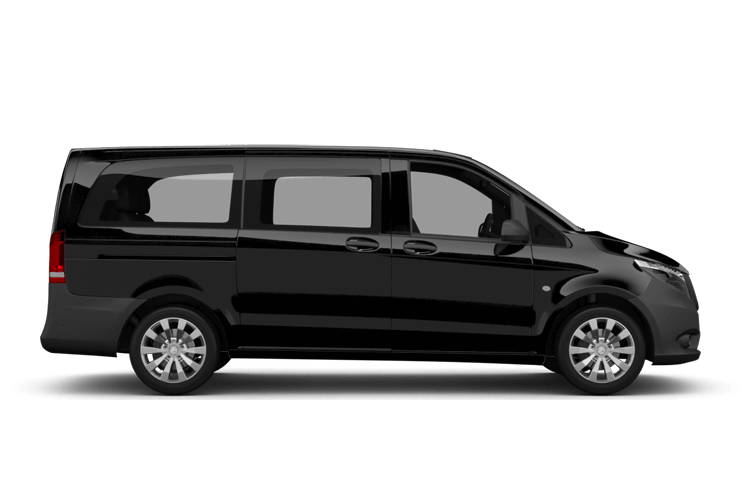
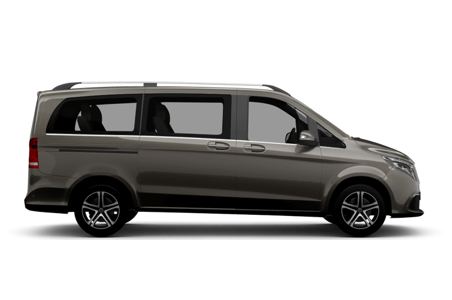

# 瑞士租車確認與車款比較報告

> Deprecated Report / 歷史報告：此頁保留作參考，目前行程以 [Main Itinerary / 主行程](瑞士旅遊規劃.md) 為準。

## 已預訂租車

| 項目 | 內容 |
|------|------|
| 租車公司 | Avis |
| 確認號碼 | 15046392TW4 |
| 取車 | 2026/6/13 22:00，Zurich Airport, Flughafen Parking 3 |
| 還車 | 2026/6/23 22:00，Zurich Airport, Flughafen Parking 3 |
| 車款 | Luxury Van - Mercedes-Benz Vito or Similar |
| 估計總額 | CHF 1,489.10 |
| 付款方式 | 櫃檯付款 |
| 里程 | 4,399 km included，超出 CHF 0.80/km |
| 油箱政策 | Full to Full |
| 訂單檔案 | [Avis Rental Confirmation](docs/orders/avis/Your%20Avis%20Rental%20Confirmation.pdf ':ignore') |

### 費用明細

| 項目 | 金額 |
|------|------|
| Base Rate | CHF 1,147.93 |
| Taxes and Surcharges | CHF 341.17 |
| Additional Driver | CHF 0.00 |
| Theft Protection (TP) | CHF 0.00 |
| Collision Damage Waiver (CDW) | CHF 0.00 |
| Estimated Total | CHF 1,489.10 |

> 以上是 Avis 確認書的估計金額。實際櫃檯付款可能因額外保險、自負額調整、加油、延遲還車或現場加購項目而變動。

---

## 租車需求

- **人數**: 6人 + 行李
- **租車地點**: 蘇黎世機場 (Zurich Airport)
- **租車日期**: 2026年6月13日 22:00 - 2026年6月23日 22:00
- **租車天數**: 10天
- **已訂車型**: Mercedes-Benz Vito or Similar

---

## 取還車提醒

1. **取車文件**: 駕照正本、國際駕照、護照、信用卡、Avis 確認書。
2. **現場確認**: CDW/TP 自負額、額外駕駛是否免費、跨境規則、道路救援與高速公路通行證。
3. **車況檢查**: 外觀、輪胎、玻璃、輪框、內裝、油量、里程都拍照留存。
4. **還車前**: 加滿油並保留加油收據，22:00 前回 Zurich Airport 還車。

---

## 已訂車款

### Mercedes-Benz Vito or Similar

| 項目 | 規格 |
|------|------|
| 座位數 | 約 8-9 人座，依實際給車為準 |
| 行李容量 | 適合 6 人與大型行李 |
| 車型等級 | Luxury Van |
| Avis 估計總額 | CHF 1,489.10 |
| 換算台幣 | 約 TWD 61,053 (以 1 CHF = 41 TWD) |

**優點**:
- 6人乘坐與行李空間較寬裕
- 適合長途自駕與山區移動
- 已完成預訂，不需再依賴即時車源

**注意事項**:
- Avis 提供的是 Mercedes-Benz Vito or Similar，實際車款以現場給車為準
- 若現場提供替代車款，需確認座位數與行李容量是否足夠
- 山路與市區停車需注意車長、車高限制

---

## 歷史比較資料

以下是預訂前比較過的車款，保留作為價格與車型參考。

### SIXT Mercedes-Benz Vito Tourer

| 項目 | 規格 |
|------|------|
| 座位數 | 9人座 |
| 行李容量 | 6件大型行李 |
| 車型等級 | Minivan |
| 每日租金 | USD $197.51/天 |
| 11天總價 | USD $2,172.58 |
| 換算台幣 | 約 TWD 68,840 (匯率1:31.7) |

### SIXT Mercedes-Benz V-Class Long

| 項目 | 規格 |
|------|------|
| 座位數 | 7人座 |
| 行李容量 | 6件大型行李 |
| 車型等級 | Premium Minivan |
| 11天總價 | USD $2,539.22 |
| 換算台幣 | 約 TWD 80,493 (匯率1:31.7) |

---

## 綜合成本試算

採用**租車 + 半價卡 (Half Fare Card)** 方案：

| 項目 | 費用 (CHF) | 費用 (TWD) |
|------|------------|------------|
| Avis 租車估計總額 | 1,489.10 | 61,053 |
| 油費預估 | ~400 | 16,400 |
| 高速通行證 | ~40 | 1,640 |
| 停車費預估 | ~150 | 6,150 |
| Lötschberg火車隧道 | ~30 | 1,230 |
| Täsch停車+接駁 | ~110 | 4,510 |
| 半價卡 (6人) | 900 | 36,900 |
| 少女峰門票 (6人，半價) | 744 | 30,504 |
| Gornergrat門票 (6人，半價) | 300 | 12,300 |
| **總計** | **~4,163** | **~170,687** |

---

*更新日期: 2026年5月17日*
*匯率參考: 1 CHF ≈ 41 TWD*
